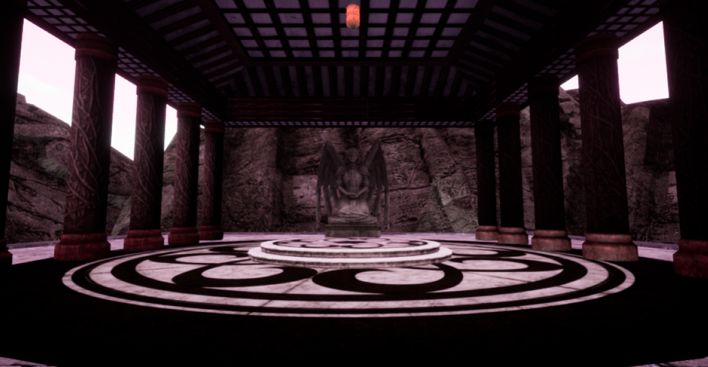

# Temple-Escaple-Unreal-Engine
An Escape Game created using Unreal Engine 4 and coded with C++

## Overview of TempleEscape

## Grab the Statue and place it on the Pressure Plate on the floor to open the doors. A rumbling sound will be heard when doors are opened. 

## Doors to escape. Doors will close after openning if the Statue is not on the Pressure Plate.

## After completing the game

### What I learnt from completing this project:
- BSP
- Lightings
- C++ Classes
- Trigger and Collision Volumes
- Lerping
- Blueprints
- Ray-Casting
- Physics Handles
- Pointer Protection
